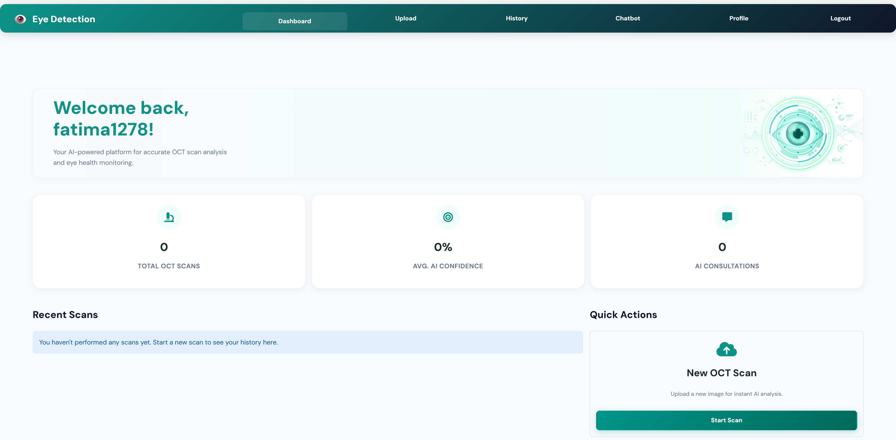
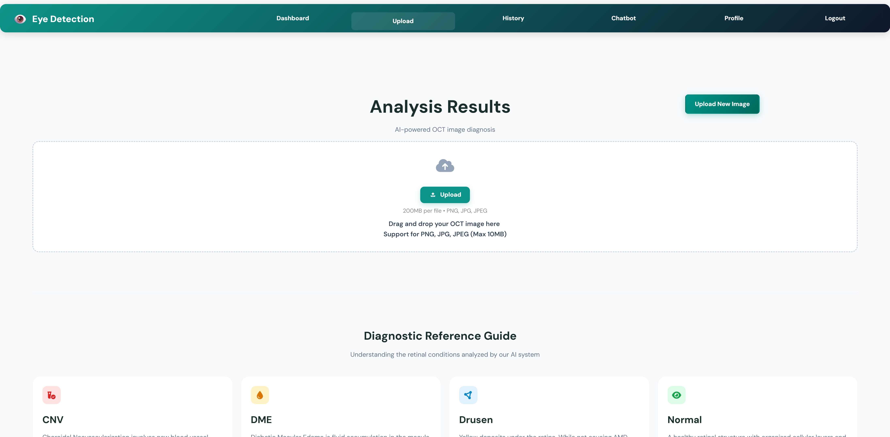
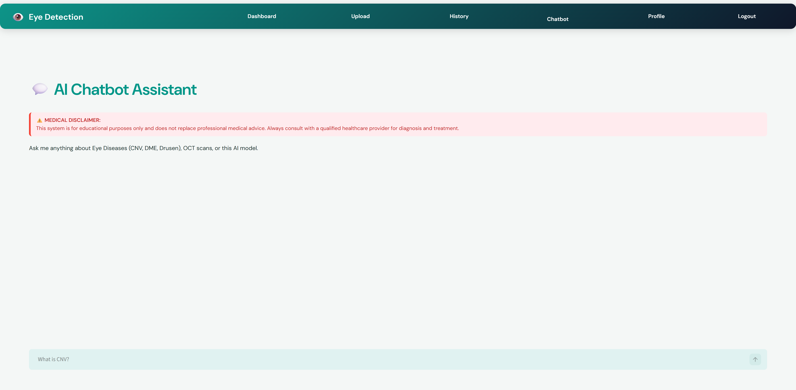
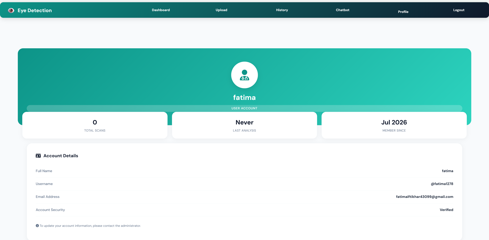
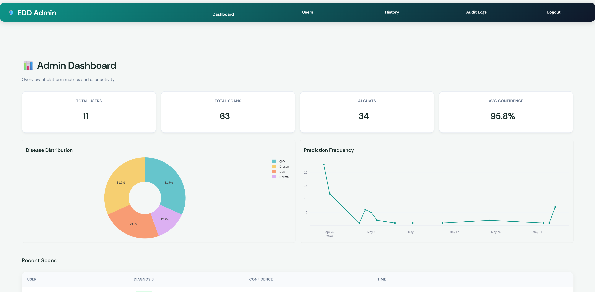
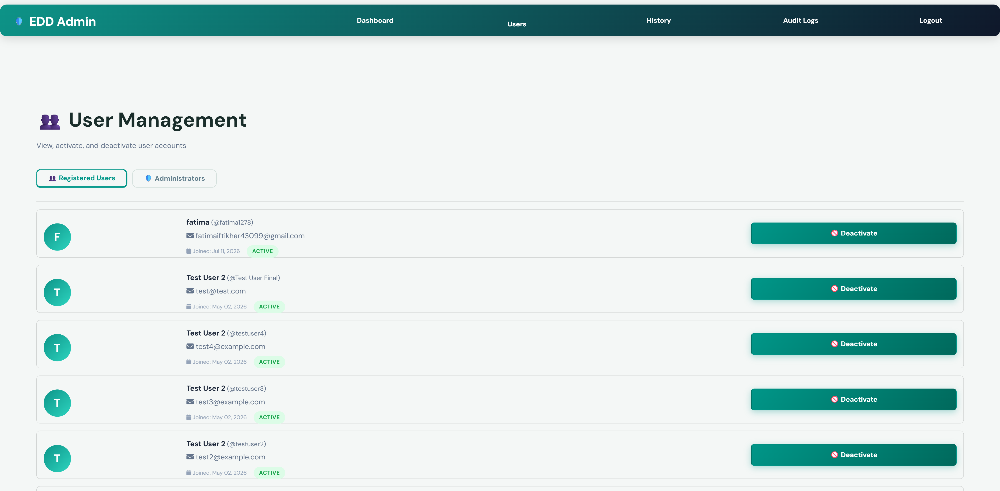
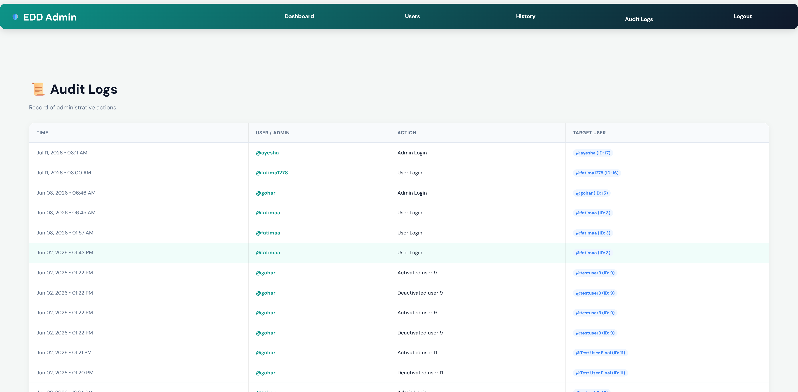
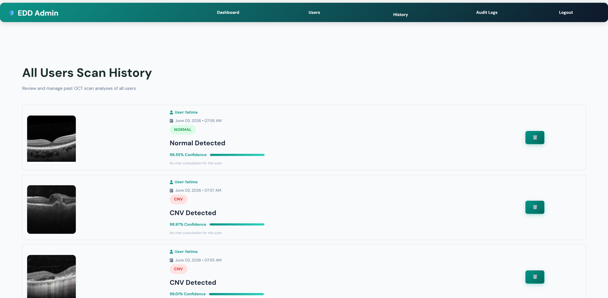

# 👁️ Retinal Disease Detection System using MobileNetV3Large with AI Chatbot


---

# 📖 Project Overview

The **Retinal Disease Detection System using MobileNetV3Large with AI Chatbot** is an AI-powered web application that automatically detects retinal diseases from **Optical Coherence Tomography (OCT)** images using Deep Learning.

The application allows users to upload retinal OCT images and receive real-time disease predictions generated by a trained **MobileNetV3Large** model. It also provides an AI chatbot for disease-related queries, user authentication, prediction history, profile management, and a complete admin dashboard for monitoring users and system activity.

The project demonstrates the practical use of Artificial Intelligence and Deep Learning in healthcare by assisting in the early detection of retinal diseases.

---

# 🎯 Project Objectives

- Detect retinal diseases from OCT images using Deep Learning.
- Provide fast and accurate disease predictions.
- Help users understand retinal diseases using an AI chatbot.
- Maintain user prediction history.
- Provide an admin dashboard for system management.
- Demonstrate AI applications in healthcare.

---

# ✨ Features

## 👤 User Module

- Secure User Registration
- User Login
- Upload OCT Retinal Images
- AI Disease Prediction
- Prediction Confidence Score
- Prediction History
- AI Chatbot
- Disease Information
- User Profile Management

---

## 👨‍💼 Admin Module

- Secure Admin Login
- Dashboard Overview
- User Management
- View All User Prediction History
- Audit Logs
- Monitor User Activities

---

## 🤖 AI & Deep Learning

The application uses **MobileNetV3Large**, a lightweight and efficient Convolutional Neural Network (CNN), through transfer learning for retinal disease classification.

### Model Details

- Model Architecture: MobileNetV3Large
- Framework: TensorFlow / Keras
- Learning Technique: Transfer Learning
- Image Size: 224 × 224 pixels
- Optimizer: Adam
- Loss Function: Categorical Crossentropy
- Output Classes: 4

---

# 🩺 Supported Disease Classes

The trained deep learning model predicts one of the following retinal diseases:

| Disease | Description |
|----------|-------------|
| **CNV** | Choroidal Neovascularization |
| **DME** | Diabetic Macular Edema |
| **Drusen** | Yellow deposits beneath the retina indicating early Age-related Macular Degeneration |
| **Normal** | Healthy retinal OCT image |

---

# 🛠 Technologies Used

### Programming Language

- Python

### Frontend

- Streamlit
- HTML
- CSS

### Backend

- Python

### Machine Learning

- TensorFlow
- Keras
- MobileNetV3Large
- OpenCV
- NumPy
- Pillow

### Database

- SQLite

### Other Libraries

- Pandas
- bcrypt
- hashlib
- streamlit-option-menu

---

# 📂 Project Structure

```
Eye-Disease-Detection-with-chatbot/

│── admin_pages/
│── assets/
│── auth/
│── chatbot/
│── db/
│── ml/
│── model/
│── screenshots/
│   ├── admin-dashboard.png
│   ├── admin-history.png
│   ├── audit-logs.png
│   ├── chatbot.png
│   ├── profile.png
│   ├── upload.png
│   ├── user-dashboard.png
│   └── user-management.png
│── uploads/
│── user_pages/
│── utils/
│── app.py
│── admin.py
│── create_admin.py
│── requirements.txt
│── README.md
│── .gitignore
```

---

# 🔄 System Workflow

1. User registers or logs into the application.
2. User uploads an OCT retinal image.
3. The uploaded image is resized to **224 × 224 pixels**.
4. Image preprocessing is performed.
5. The MobileNetV3Large model extracts image features.
6. The model predicts one of the following classes:
   - CNV
   - DME
   - Drusen
   - Normal
7. The prediction result and confidence score are displayed.
8. The prediction is stored in the user's history.
9. Users can interact with the AI chatbot for disease-related information.

---

# 📊 Model Performance

The MobileNetV3Large model was trained using transfer learning on an OCT retinal image dataset.

| Metric | Value |
|---------|--------|
| Training Accuracy | Add Your Value |
| Validation Accuracy | Add Your Value |
| Test Accuracy | Add Your Value |

---

# 🚀 Installation

## Clone Repository

```bash
git clone https://github.com/fatimadev30/Eye-Disease-Detection-with-chatbot.git
```

## Move to Project Folder

```bash
cd Eye-Disease-Detection-with-chatbot
```

## Create Virtual Environment

```bash
python -m venv venv
```

## Activate Virtual Environment (Windows)

```bash
venv\Scripts\activate
```

## Install Required Packages

```bash
pip install -r requirements.txt
```

## Run User Application

```bash
streamlit run app.py
```

## Run Admin Panel

```bash
streamlit run admin.py --server.port 8502
```

## Create Admin Account

```bash
python create_admin.py
```

---

# 🗄 Database

SQLite is used to store:

- User Accounts
- User Profiles
- Disease Prediction History
- Audit Logs

---

# 📸 Application Screenshots

## 👤 User Dashboard



---

## 📤 Disease Prediction



---

## 🤖 AI Chatbot



---

## 👤 User Profile



---

## 👨‍💼 Admin Dashboard



---

## 👥 User Management



---

## 📜 Audit Logs



---

## 📋 Prediction History



---

# 🔒 Security Features

- Password Hashing
- Secure User Authentication
- Admin Authorization
- Session Management
- Role-Based Access Control

---

# 🔮 Future Enhancements

- Email Notifications
- Explainable AI (XAI)
- Cloud Database Integration
- Multi-language Support
- Mobile Application
- Improved Model Performance
- Additional Retinal Disease Classes
- Doctor Appointment Integration

---

# 👩‍💻 Author

**Fatima Iftikhar**

Bachelor of Computer Science

📧 Email: **fatimaiftikhar4309@gmail.com**

🔗 GitHub: **https://github.com/fatimadev30**

---

# 📄 License

This project is developed for educational and academic purposes.

---

# 🙏 Acknowledgements

This project was developed using the following open-source technologies:

- TensorFlow
- Keras
- Streamlit
- OpenCV
- NumPy
- Pandas
- SQLite
- Python

Special thanks to the open-source community for providing the tools and resources that made this project possible.

---

# ⭐ Support

If you found this project useful, please consider giving it a ⭐ on GitHub.

Your support is appreciated and motivates future improvements.